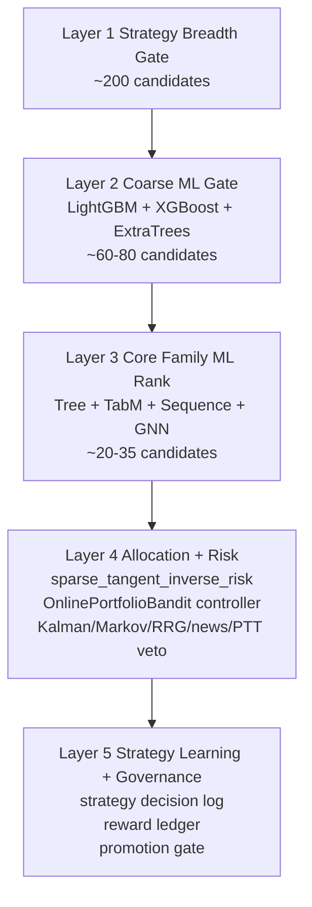

# Screener Refactor Roadmap 2026-05-29

> Status: local implementation closure completed; production rollout is pending Wei approval. This document is the source-of-truth plan for P0-P9 plus strategy-learning. No commit, push, deploy, retrain, or live trading action is authorized by this plan.

## Target Flow

## Layer Contract

| Layer | Purpose | Formal components | Not allowed here | Output |
|---|---|---|---|---|
| L1 Strategy Breadth Gate | Keep breadth without sending the whole market to ML | Three strategy seeds, liquidity, data completeness, Score V2 seed score, strategy quota | RRG/news/PTT/heavy ML | about 200 |
| L2 Coarse ML Gate | Cheap feature-model cut before heavy sequence/family work | LightGBM, XGBoost, ExtraTrees rank scores | TimesFM/iTransformer/GNN/news/PTT | about 60-80 |
| L3 Core Family ML Rank | True ranking and family evidence | Tree family, TabM, learned sequence, GNN family scores | single-model equal vote | about 20-35 |
| L4 Allocation + Risk | Decide weights and executable BUY slate | sparse_tangent_inverse_risk, OnlinePortfolioBandit knob controller, Kalman/Markov overlays, RRG/news/PTT veto | rank_topK_equal_weight | weighted BUY slate |
| L5 Strategy Learning | Learn which strategy specs work without silent prod mutation | strategy_decision_log, strategy_reward_ledger, strategy_policy_state, promotion gate | direct strategy self-mutation without approval | candidate policy evidence |

## Implementation Roadmap

| Phase | Goal | Implementation | Acceptance |
|---|---|---|---|
| P0 | Remove FT from active path | Keep FT retired from active alpha vote, active training policy, and recommendation context. Residual research-only code can remain until a separate cleanup branch deletes old adapters/tests safely. | Reports and active ensemble no longer list FT as a contributor. |
| P1 | Build Layer 1 | Worker writes explicit strategy-breadth evidence and keeps candidate pool near 200 before overlays. | screener_funnel metadata has L1 breadth counts and strategy evidence. |
| P2 | Build Layer 2 | ml-controller runs feature-model batch first, scores coarse models, and sends only the core shortlist to heavy sequence/state-space jobs. | DLinear/PatchTST/Kalman/Markov batch inputs are core-size, not full L1/L2 seed count. |
| P3 | Build Layer 3 | ensemble_v2 keeps family vote evidence and recommendation payload exposes family scores/members. | ml_vote_summary includes familyVote and contributing family metadata. |
| P4 | Connect allocator | sparse_tangent_inverse_risk receives real payload-derived return history. | allocation metadata records non-empty return history coverage when prices exist. |
| P5 | OPB controller | OnlinePortfolioBandit controls allocator knobs, while sparse_tangent remains the weight engine. | alpha_allocation records selected OPB arm and selected weights. |
| P6 | Adaptive params | Adaptive sizing controls candidatePool/coarseQueue/coreShortlist and allocator knobs as candidates only. | adaptive config changes size knobs without direct promotion. |
| P7 | Promotion gate | Keep model artifact, parameter config, meta policy, and strategy policy promotion lines separate. | strategy-learning and model promotion require evidence and Wei approval. |
| P8 | Production cleanup | Remove hidden top-k fallback from hot allocation path and make retired paths explicit. | rank_topK_equal_weight is rollback-only, not silent hot path. |
| P9 | Strategy-learning closure | Ensure scheduler-visible strategy-learning can materialize decisions/rewards/policy state after recommendation rows exist. | post-verify-chain can produce non-zero strategy_decision_log rows for current business-date runs. |

## Local Closure Verification

- Worker type-check: `npm run type-check` passed.
- Frontend type-check: `npx tsc --noEmit` passed.
- Frontend build: `npm run build` passed after sandbox EPERM retry with escalation for local esbuild spawn only.
- ML controller regression subset: `89 passed`.
- ML service regression subset: `12 passed`.
- Whitespace gate: `git diff --check` passed with CRLF warnings only.
- Second-pass consistency audit removed stale `/8` alpha denominator wording, aligned frontend card diagnostics to the 10-slot alpha surface, disabled the legacy ResidualMLP/GNN prediction-runtime shadow side-channel, and changed model-pool initialization so it writes empty `shadow_models` plus explicit `formal_layer3_slots`.
- Third-pass hot-path audit removed the single-stock Chronos execution path, changed `feature_version` away from the stale `v4_9models` label, made model-pool status/lineage backfill `formal_layer3_slots`, blocked ResidualMLP/GNN `experimental_shadow` artifact paths in the router, and removed stale Model Pool page shadow/challenger wording.
- Production actions intentionally not executed: no commit, push, deploy, retrain, scheduler rerun, or live trading mutation.

## Non-Goals In This Pass

- No retrain.
- No deploy.
- No commit/push.
- No live broker or real-order mutation.
- No deletion of large historical FT research files unless active tests prove they are on the production path.
