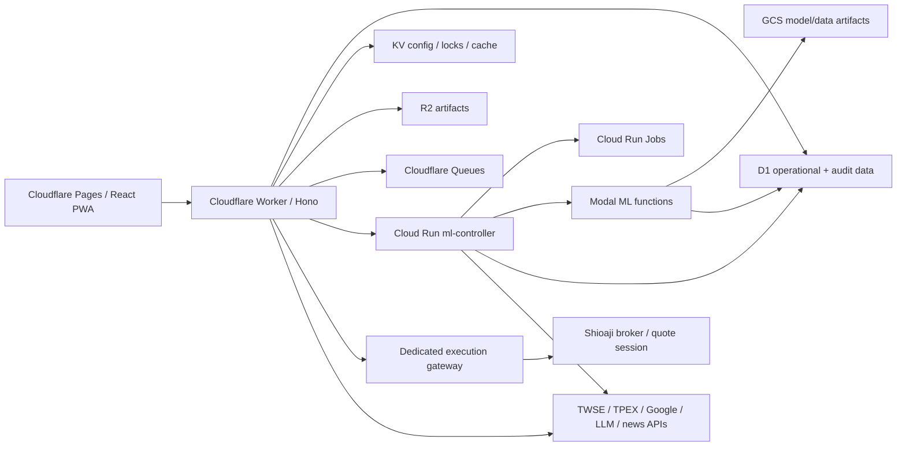
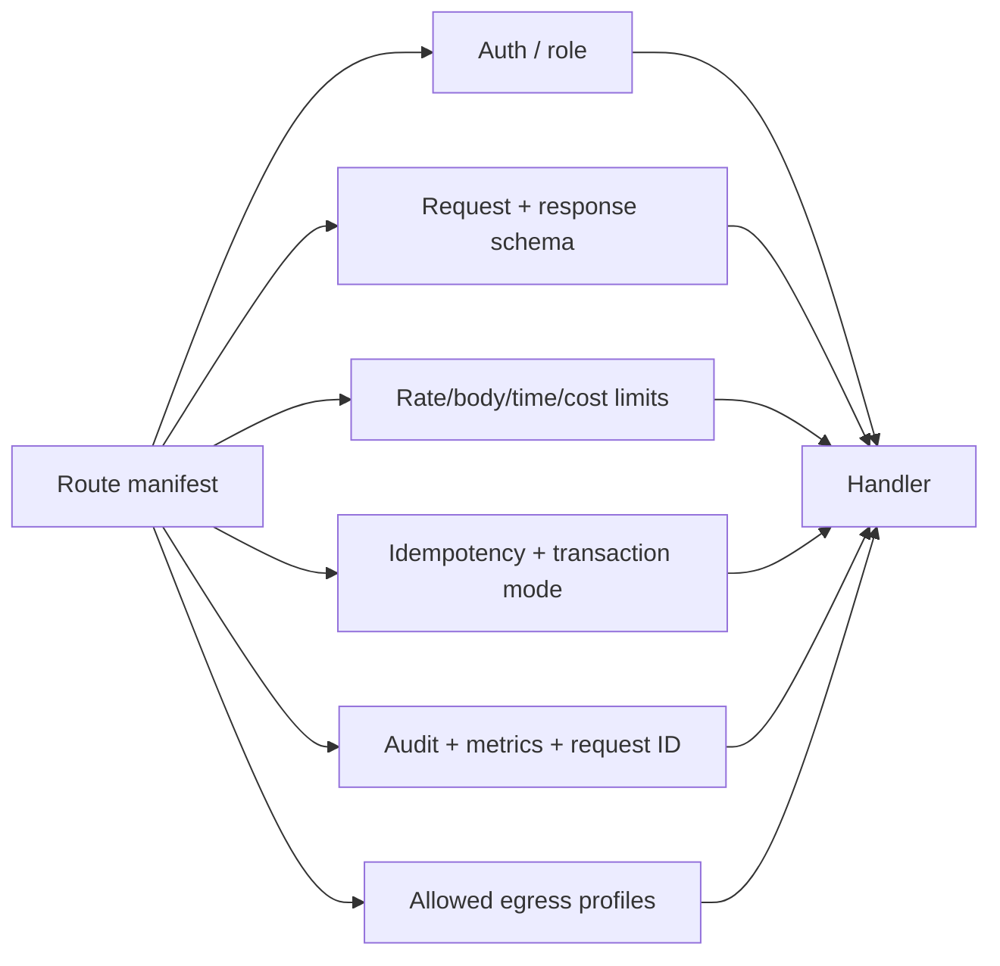

# StockVision 全系統 Code Review 與優化分析

日期：2026-07-14（Asia/Taipei）
狀態：歷史初始掃描基線；目前修補與 production blocker 以 `docs/REAL_TRADING_DATABASE_SECURITY_REVIEW_2026-07-16.md` 為準。
範圍：Cloudflare Worker、Frontend、D1/KV/R2/Queue、GCP Cloud Run Service/Jobs、Modal、ML service、Shioaji execution gateway/proxy、跨 process contracts、部署與文件治理。
性質：source review + production GCP runtime read-only verification；未 deploy、未 retrain、未寫 production DB、未觸發真實下單。

## 1. Executive conclusion

目前系統不是缺少個別 `try/except` 或單點 SSRF patch，而是缺少三個全局 control plane：

1. **Route policy control plane**：377 個靜態 route registration 沒有單一 manifest 管 auth、role、rate limit、body size、request/response schema、idempotency、audit、timeout 與 cost class。
2. **Egress control plane**：150 個 syntactic outbound HTTP call site 分散在 Worker/Python；其中至少 4 個 Modal callback 是 payload-controlled URL，且會附帶內部 token 或跟隨 redirect，屬 privileged SSRF sink。
3. **Contract/transaction control plane**：部分跨 process API 用 HTTP 200 + `{"error": ...}` 表示失敗；D1 pipeline 宣稱 atomic，實際 helper 可降級成逐筆 REST write 並允許 partial failure，部分 caller 還忽略 result、回報預期寫入筆數。

整體判定：

- **安全邊界：需 P0 修復。** 最重要的是 ML service auth fail-open/Optuna router bypass、Modal callback SSRF、D1 非原子寫入假成功。
- **contract integrity：需 P0/P1 修復。** Recommendation 的 formal-model gate 本身有嚴格過濾，但 transport、batch provenance、persistence acknowledgement 仍可繞過語意。
- **架構可維護性：高風險。** 377 routes、598 個 broad/bare exception handlers、1,630 個 TypeScript `any` occurrence、僅 1 個 FastAPI `response_model`，加上多個 3,000–5,000 行模組，讓全局 contract 無法靠人工維持。
- **production runtime：可運作但設定與程式模型不匹配。** `pipeline-v2` 於 2026-07-14 最新 execution 成功；但 `ml-controller` 使用 4 vCPU、單一 Uvicorn process、concurrency 40、CPU throttling、default Compute service account、public ingress，與大量同步 D1/CPU work 不匹配。

## 2. Review baseline

### 2.1 實際盤點結果

| 項目 | 實際結果 | 判讀 |
|---|---:|---|
| Worker/Hono route registrations | 196 | 僅計 route literal registration，不把一般 `.get()` 誤算成 route |
| Python/FastAPI route registrations | 181 | 排除 tests、venv、benchmarks |
| 全系統靜態 route registrations | **377** | 題述 340 已不是目前 source baseline |
| TypeScript `fetch()` | 110 | Worker + Frontend production source |
| Python HTTP calls | 40 | `httpx` / `requests` / `urllib` syntactic sinks |
| outbound HTTP syntactic call sites | **150** | 不是全部都可利用 SSRF |
| `except Exception` / `BaseException` | 581 | production + scripts/tools，排除 tests/venv |
| bare `except:` | 17 | 同上 |
| broad/bare handlers 合計 | **598** | AST 重新解析確認 |
| 無 log 且無 re-raise 的 broad/bare handlers | **272** | 包含合理 optional fallback，也包含 silent contract degradation |
| Python routes 使用 `response_model` | **1 / 181** | contract 幾乎全靠 dict convention |
| TypeScript `any` occurrences | **1,630** | contract erosion 的量化指標，不等同 1,630 個 bug |
| `worker/schema.sql` | 69 tables / 83 indexes | 可在 SQLite memory 成功執行 |
| root-level `migration_*.sql` | 113 files | 無 Wrangler canonical migration directory |
| migration CREATE TABLE unique names | 138 | 包含中繼 rename/new tables |
| migrations 有、schema snapshot 無的 table names | **93** | `schema.sql` 不能作 production schema source of truth |

### 2.2 Route 分布

Hono 最大 route owners：

- `worker/src/routes/other.ts`：45
- `adminReadRoutes.ts`：32
- `stocks.ts`：19
- `adminWriteRoutes.ts`：18
- `dashboardReadRoutes.ts`：15
- `paper.ts`：14
- `auth.ts`：9

Python 最大 route owners：

- `ml-service/app/main.py`：22
- `ml-controller/routers/model_pool.py`：19
- `ml-controller/routers/obsidian.py`：15
- `ml-controller/routers/optuna.py`：15
- `shioaji-proxy/main.py`：13

### 2.3 Source-of-truth 判讀

- April handoff PDFs 仍可用來理解歷史意圖，但其「58 tables、10-model、Cloudflare cron schedule、R4 pending」等內容已與 2026-07 source/runtime 明顯漂移。
- `ML_POOL_ARCHITECTURE.md` 仍描述早期 draft/champion-challenger 語意；目前 repo 與 wiki 已轉向 artifact registry、active lifecycle、formal evidence contracts。
- `worker/wrangler.toml` 的 cron list 為空，且程式明確把 GCP Scheduler 設為 production owner；舊 operations PDF 的 cron reference 不可再當 runtime truth。
- 過去決策與效能判讀以 Obsidian hits 為主；repo behavior 以目前 code 為主；production 狀態只採已成功讀回的 GCP runtime evidence。

## 3. Current architecture



核心問題不是元件選型，而是相同責任在多個 process 重複實作：auth token parsing、HTTP retry、error envelope、callback URL、D1 batch semantics、contract status、logging、cost attribution 都有多個版本。

## 4. Prioritized findings

### P0-01 — ML service auth fail-open，Optuna router 完全繞過 token

**Evidence**

- `ml-service/app/main.py:68-85` 先 `include_router(optuna_router)`，之後才定義 `verify_service_token`。
- `ml-service/app/optuna_routes.py:44` 建立 router；7 個 endpoint（`117, 172, 211, 249, 293, 333, 395`）都沒有 dependency/auth。
- `ml-service/app/main.py:77-85` 在 `ML_SERVICE_SECRET` 空值時直接 return，沒有 production fail-closed 判斷。

**Impact**

- 若這個 FastAPI app 仍由任何 `ML_SERVICE_URL` 對外可達，Optuna 可匿名讀 D1、跑昂貴 search、push KV。
- 即使 7 個 Optuna route 修 auth，其餘 ML endpoint 仍可能因漏設 secret 而整體公開。

**Root cause**

- auth 是 handler 內手動呼叫，不是 application/router policy。
- optional router import 發生在 security dependency 建立之前。

**Required fix**

- App startup 在 production 缺 `ML_SERVICE_SECRET` 時直接 fail startup。
- `APIRouter(dependencies=[Depends(require_service_auth)])` 或 app-level dependency；只有 `/health/live` 進 public allowlist。
- CI route manifest 必須證明每個 route 有 policy；禁止 handler 內手動 auth 作唯一防線。
- 若 HTTP ML service 已非 production path，直接 retire app/route，不保留半活 legacy surface。

**False-positive boundary**

- 目前 source review 無法證明此 app 正在 production serving；若完全未部署，風險是 dormant exposure，不是已被利用。仍應移除或 fail-closed。

### P0-02 — 4 個 privileged Modal callback SSRF sinks

**Evidence**

1. `ml-service/modal_app.py:321,1061-1089`：`followup_webhook_url` 來自 payload；附 `X-Service-Token`；`follow_redirects=True`。
2. `ml-service/modal_app.py:1231-1256`：`callback_url` 與 `callback_token` 來自 payload；同時附 Bearer 與 service token；`urllib.urlopen` 會處理 redirects。
3. `ml-service/modal_app.py:2490-2527`：state-space `callback_url` 來自 payload；可附 token；`follow_redirects=True`。
4. `ml-service/modal_app.py:2691-2755`：controller/worker callback URL 與 tokens 可由 payload 提供；使用 `urllib.urlopen`。

**Impact**

- 可向 loopback、private network、link-local/metadata endpoint 或攻擊者控制的 redirect 發 request。
- 最大風險不是 blind fetch，而是 **credential forwarding**：內部 callback token 可能被送到非預期 host。
- Modal function 需要憑證才能呼叫，降低一般網路攻擊面，但任何 compromised controller、錯誤 dispatch payload、內部低權限 caller 都可放大為 privileged SSRF。

**Required fix**

- payload 只能帶 `callback_id`/enum，不可帶 raw URL 或 raw token。
- Modal container 由 server-side destination registry 解析固定 origin + fixed path。
- redirect 一律關閉；如業務必須 redirect，每一 hop 重新 canonicalize、resolve DNS、驗 IP、驗 host，再決定是否附 credential。
- 建立 Python `EgressPolicy` / TypeScript `safeFetch`，預設 HTTPS、exact-host allowlist、禁止 credentials in URL、fragment、localhost、private/link-local/multicast/reserved IP，限制 response bytes、timeout、retry budget。
- metadata identity endpoint另設 explicit `gcp_metadata` policy，不可走 generic external policy。

### P0-03 — Daily pipeline 宣稱 atomic，實際可 partial write 且回報假成功

**Evidence**

- `ml-controller/graphs/daily_pipeline_v2.py:2780-2784` 宣稱「All in D1 batch_execute for atomicity」。
- 同 node 依序執行 prediction cleanup/write、L2 audit、L3 audit、recommendation update、filtered marking、rerank；它們是多個獨立 call，不是一個 transaction。
- `ml-controller/services/d1_client.py:242-320` 的 `batch_execute()` 若 Worker batch、raw batch 失敗，會降級成逐筆 REST loop；失敗時繼續下一筆並回 `partial_failure`，不 raise。
- `recommendation_service.py:4290-4293` 的 prediction writer 忽略 `batch_execute()` result，直接回 intended `inserted_rows`。
- `recommendation_service.py:4359-4365`、`4494-4500` 的 L2/L3 audit writer同樣忽略 result並回 intended count。
- `d1_client.py:263-275` 的 allocator no-op guard 回 `success_count=total`、`changes_total=total`、`rows_written_total=total`，雖然完全未 persist。

**Impact**

- pipeline callback 可顯示 success/closure，但 prediction/audit rows 可能只寫一部分。
- recommendation update 雖檢查 changes，但前段 prediction/audit 已可能殘留；rerank 也可能 partial。
- no-op contract run 的「成功寫入」metrics 是語意假資料，會污染 audit 判斷。

**Required fix**

- 將 generic helper 分成：`atomic_batch_execute`、`best_effort_batch_execute`、`dry_run_batch`，禁止一個 API 自動改變 durability semantics。
- canonical pipeline 只用 fail-closed atomic/staged path；任何 partial failure raise `PersistenceContractError`，job non-zero exit。
- 超過 D1 batch 上限時，先寫 `run_id` staging rows，全部驗證後以單一 `run_heads` pointer/promote transaction 發布；reader 只讀已 promoted run。
- 所有 writer 回傳實際 `persisted_rows`、`failed_rows`、`atomic`、`commit_id`；caller 必須 assert。
- dry-run 回 `persisted=false`、`simulated_changes`，不可偽裝 `changes_total`。

### P0-04 — True-batch fallback 仍宣告 true-batch contract

**Evidence**

- `ml-service/app/batch_prediction.py:754-764`：feature/runtime override 建立失敗時，broad catch 靜默回到 serial owner，沒有 log、沒有 fallback flag。
- `ml-service/app/batch_prediction.py:786-793`：不論是否 fallback，metrics 永遠寫 `contract: modal_predict_batch_v2_true_batch`。

**Impact**

- artifact/schema drift 可讓 true-batch 路徑失效，但 telemetry、audit、cost/performance attribution 仍報 true-batch。
- contract test只能看到 output shape，無法證明真正使用 GraphSAGE/TabM batch override。

**Required fix**

- 回傳 `execution_mode: true_batch | serial_fallback | serial_configured`、`fallback_reason_code`、`fallback_exception_class`、`batch_override_contract_passed`。
- formal pipeline 若要求 true-batch，fallback 應 fail stage；只有明確標為 degraded 的非正式路徑可接受 serial fallback。
- exception 至少 structured warning，禁止 silent catch。

### P1-05 — Exception semantics 全局不一致

**Evidence**

- 598 個 broad/bare handlers；272 個無 log 且無 re-raise。
- `ml-controller/routers/backtest.py:56-58` 等多個 route catch 後回 `{"status":"error"}`，HTTP status 仍為 200。
- `ml-controller/services/modal_client.py:1030-1048` 將 HTTP/network error 轉成 `NO_SIGNAL` dict，沒有 structured log。
- `ml-controller/routers/external_evidence.py:110-111`、`routers/debate.py:76-78` 等直接把 `str(exc)` 放入 HTTP detail。
- Modal 多個 function 把 traceback 放入 return payload，例如 `modal_app.py:1444,1539,1764,2162,2305`。

**Impact**

- retry/circuit breaker、scheduler、client telemetry 無法根據 HTTP status 判定失敗。
- expected degradation 與 invariant violation 混在同一 `except Exception`。
- raw exception/trace 可能洩漏路徑、provider response、query 或 runtime detail。

**Required semantic matrix**

| Layer | Expected behavior |
|---|---|
| Route boundary | validation/auth/not-found/conflict/upstream/contract exception 映射標準 HTTP status；唯一 global error mapper；client 只拿 stable error code |
| Service/domain | 不產 HTTP response；expected business outcome 用 typed result；invariant/contract violation raise typed exception |
| Repository/egress | 保留 cause 並 raise typed `RepositoryError`/`UpstreamError`；只在 retry/final boundary log，避免重複 stack |
| Per-item batch | 只有已定義可 partial 的工作回 item-level error；batch envelope 必須列 partial/degraded/failed count |
| Shadow/optional enrichment | warning + `degraded=true` + provenance；不得改變 primary mutation outcome |
| Job/process top level | structured exception log、terminal callback error、non-zero exit；不可只 return error dict |

禁止機械替換。每個 catch 需標成 `recover`、`degrade`、`translate`、`cleanup_then_raise`、`terminal` 五類之一；CI 拒絕未標註的新 broad catch。

### P1-06 — Route contract 沒有全局 registry

**Evidence**

- Worker 在 `index.ts:134-160` 掛載大量 routers；auth 有 router middleware、per-handler middleware、handler 內 `require*` 三種模式。
- `strategyDiscoveryRoutes.ts:12`、`paper.ts:661` 等已使用 router-level middleware，證明統一模式可行；但 admin route 多為逐 handler 驗證。
- Python controller 的 router-level dependencies較完整（`ml-controller/main.py:77-124`），但 ML service與 Shioaji仍手動驗證。
- 181 個 Python routes 只有 1 個 `response_model`。
- 1,630 個 TypeScript `any` occurrence，`frontend/src/lib/api.ts` 單檔 1,371 行。

**Required design**

建立 machine-readable `RoutePolicy`：

```text
route_id
method / path / owner
auth = public | user | admin | service | admin_or_service
mutation = none | idempotent | transactional | external_side_effect
request_schema / response_schema / error_schema
rate_limit / body_limit / timeout / cost_class
idempotency_required / audit_event / egress_profiles
```

- Hono：只允許 `defineRoute(policy, handler)` 或 policy-scoped router；raw `.get/.post` 在 route directories 由 ESLint/AST gate 阻擋。
- FastAPI：router factory 自動套 dependencies、response model、request ID、body limit、exception mapping。
- build 產出 route manifest；CI assert static registration count 與 manifest count一致，public routes必須 explicit allowlist。

### P1-07 — GCP runtime identity、ingress、concurrency 與 image coupling

**Production evidence（2026-07-14 read-only）**

- `ml-controller` latest ready revision：`ml-controller-00577-lmf`。
- ingress：`all`；maxScale：5；containerConcurrency：40；4 vCPU / 4 GiB；timeout 3600 秒；CPU throttling true。
- service identity：default Compute service account `530028717113-compute@developer.gserviceaccount.com`。
- `pipeline-v2`：4 vCPU / 4 GiB、timeout 1800 秒、maxRetries 0；latest execution `pipeline-v2-nwll8` 成功。

**Source evidence**

- `deploy_ml_controller.sh:728-734` deploy service時沒有顯式設定 service account、ingress、concurrency、CPU/memory/max instances，依賴既有 mutable state。
- `deploy_ml_controller.sh:423-445,474-498,525-549,578-602` 多個 jobs 共用 `RUN_SECRET_BINDINGS`。
- root `Dockerfile` 把 controller、worker runtime、ml-service source、tools、資料 artifacts 放進同一 image，且 controller image以 root user執行。
- `ml-controller/routers/admin.py` 允許 production controller用 Modal token直接 deploy Modal，將 serving plane 與 deploy plane 合併。

**Impact**

- default service account 的 blast radius 不可由 repo證明最小化。
- 4 vCPU + single Uvicorn process + sync CPU/D1 code容易形成 single-core hotspot；concurrency 40 增加 queueing、memory與 D1 pressure。
- serving compromise 可取得 Modal deploy、GCS、Cloudflare、FinLab/Shioaji等跨 domain credentials。
- deploy script未宣告完整 runtime，revision behavior 可漂移。

**Required fix**

- Terraform/Cloud Deploy 宣告 service/job/service account/IAM/ingress/concurrency/resources/probes/secrets，禁止 inherited settings。
- controller、pipeline、verify、screener、Optuna、strategy mining、execution gateway 各用 dedicated service account與最小 secrets。
- serving controller移除 deploy capability；Modal deploy移到 CI approval job。
- controller long tasks只 dispatch Cloud Run Job/Modal；HTTP service timeout降至合理值。
- profiling前先把 concurrency降至 4–8，或完成全 async I/O + 明確 thread/process pool後再提高。

Google 官方也建議 Cloud Run 使用 user-managed least-privilege service account，且 single-threaded/multi-vCPU workload需特別調低 concurrency：

- <https://docs.cloud.google.com/run/docs/securing/service-identity>
- <https://docs.cloud.google.com/run/docs/about-concurrency>

### P1-08 — Shioaji proxy auth coverage不完整

**Evidence**

- quote/orderbook核心 endpoints有 `verify_token`。
- `shioaji-proxy/main.py:1339-1391` `/twse-chips` 與 `1394-1452` `/tpex-chips` 沒有 Authorization parameter或 token verification。

**Impact**

- 不是直接下單 bypass，但可匿名觸發外部 TWSE/TPEX calls、消耗連線/CPU，並形成與其他 internal proxy routes不同的安全模型。

**Fix**

- app/router global service auth；只 allowlist `/health/live`。
- public market-data proxy若確實需要公開，拆成獨立 low-privilege service並加 cache/rate limit，不與 broker session共 process。

### P1-09 — Frontend JWT exposure 與 Pages security headers缺口

**Evidence**

- `frontend/src/lib/api.ts:6,25-33` 把 7-day JWT放在 `sessionStorage`。
- Frontend沒有 `_headers`，Worker `index.ts` 的 CSP/security headers只保護 Worker API，不保護 Cloudflare Pages HTML。
- `frontend/src/components/ui/chart.tsx:79-91` 使用 `dangerouslySetInnerHTML` 建 CSS；目前 config看似內部來源，但這使任何未來 server-driven chart color/key 成為 CSS injection boundary。
- `frontend/index.html:6,21-23` 有 mojibake；line 21 的 `content` attribute缺 closing quote。Vite build不會把它視為 error，輸出的 `dist/index.html` 仍保留 malformed markup。
- JWT verifier只在 payload含 `exp` 時檢查 expiration（`worker/src/lib/auth.ts:58-70`），沒有 issuer/audience/required-claim policy。

**Impact**

- 任一 XSS 可直接讀 admin JWT；Pages缺 CSP使風險放大。
- malformed HTML影響 SEO/OG、browser parse與 security meta的可預期性。

**Fix**

- 優先改 `HttpOnly; Secure; SameSite=Strict/Lax` session cookie + CSRF/origin check；若暫留 bearer token，至少短 TTL + strict Pages CSP + Trusted Types評估。
- Pages `_headers` 設 CSP、HSTS、frame-ancestors、nosniff、Referrer/Permissions policy；CSP先 report-only再 enforce。
- JWT required claims：`exp`,`iat`,`jti`,`iss`,`aud`,`sub`; verifier缺任何 required claim即拒絕。
- 修復 `index.html` UTF-8與 quote，加入 HTML validation CI。

### P1-10 — D1 migration governance失去單一 source of truth

**Evidence**

- 113 個 `worker/migration_*.sql` 平鋪在 root，沒有序號化 migration directory。
- `wrangler.toml` 未設定 `migrations_dir`/`migrations_table`。
- `schema.sql` 69 tables，但 migrations出現 138 unique table names；93 個 migration table names不在 schema snapshot。
- migration filenames有日期、有無日期、功能名混用，無 deterministic dependency order。

**Impact**

- 無法可靠回答「fresh database會得到什麼 schema」「production已套哪些 migrations」「rollback/forward fix順序」。
- schema.sql成功執行不代表 production parity。

**Fix**

- 建 `worker/migrations/0001_...sql` canonical ledger，Wrangler記錄 applied migrations。
- 對現有 production做一次 read-only schema dump/checksum，建立 baseline migration；後續只 forward migration。
- `schema.sql` 改成由 migrations自動生成的 snapshot，不允許手改。
- CI在空 DB依序 apply全部 migrations、跑 `foreign_key_check`、index/query-plan tests、schema checksum。

Cloudflare官方 migration flow即以有序 `.sql` files與 migration ledger為核心：<https://developers.cloudflare.com/d1/reference/migrations/>。

### P1-11 — Async route下存在 sync I/O/CPU，runtime concurrency放大阻塞

**Evidence**

- controller大量 service使用同步 `httpx`/D1 client，部分 async node有 `asyncio.to_thread`，部分直接呼叫 sync functions，模型不一致。
- `ml-controller/services/modal_client.py:1030-1080` legacy HTTP batch每股一 request、concurrency 20；與 true batch path並存。
- Cloud Run service concurrency 40、單 Uvicorn process、CPU throttling true。
- wiki runtime evidence曾顯示 state-space average約 306 秒、predict_batch_v2約 104 秒；目前 code仍有多個 max_containers=1的長任務。

**Impact**

- event loop blocked時，40 concurrent requests不是吞吐，而是 tail latency與timeout放大器。
- per-stock HTTP fan-out與 batch inference同時存在，增加 cold starts、connection overhead與語意分歧。

**Fix**

- Controller只保留 async `httpx.AsyncClient` factories與 async repository；CPU工作移 Job/Modal或 bounded executor。
- 正式預測只留一個 batch endpoint；per-stock path僅 debug且不進 production pipeline。
- 以 stage latency、queue time、D1 rows read/written、Modal cold-start/cache-hit做 profiling，再決定 concurrency/chunk size。

### P2-12 — Modal單一 App與 shared secret blast radius過大

**Evidence**

- `ml-service/modal_app.py:75-105` 以單一 App載入 GCS、Cloudflare、FinLab secrets；約 30 個不同性質 functions共享 image/app context。
- `modal_app.py:92-99` `stockvision-cf` secret不存在時只印訊息並以空 secret繼續 deploy。
- 同一檔含 production inference、retrain、walk-forward、Optuna、backfill、strategy mining、callbacks。

**Impact**

- inference function compromise可接觸不必要的 D1/GCS/FinLab credentials。
- image dependency/cold-start與 deploy blast radius擴大；research變更可迫使 production inference一起 redeploy。

**Fix**

- 拆 `inference-app`、`training-app`、`research-app`、`data-backfill-app`。
- secrets只放到需要的 `@app.function(secrets=[...])`；官方建議也以 function/cls decorator注入：<https://modal.com/docs/guide/secrets>。
- production必需 secret在 deploy/preflight fail-closed。
- 模型 inference改 `@app.cls`/container enter preload；版本與 artifact digest固定在 invocation contract。

### P2-13 — 巨型模組與跨 layer責任混合

最大檔案：

| File | Lines |
|---|---:|
| `worker/src/lib/marketScreener.ts` | 5,213 |
| `ml-controller/services/recommendation_service.py` | 5,117 |
| `ml-controller/services/backtest_engine.py` | 5,050 |
| `worker/src/lib/s12IntradayStructure.ts` | 4,816 |
| `worker/src/routes/other.ts` | 4,243 |
| `ml-controller/graphs/daily_pipeline_v2.py` | 3,439 |
| `ml-controller/services/model_artifact_registry.py` | 3,268 |
| `worker/src/lib/updateOrchestrator.ts` | 3,143 |
| `ml-service/modal_app.py` | 2,998 |
| `frontend/src/components/RecommendationCardClean.tsx` | 3,318 |

**Impact**

- route、domain、repository、serialization、audit、fallback混在一起；任何修改難以證明只影響一個 contract。
- 測試傾向驗字串/shape，難驗 module boundary與 side effect。

**Fix sequence**

1. 先建立 route/egress/error/persistence control planes，不先拆檔。
2. 以 bounded context拆：market data、screener、formal prediction、recommendation/ranking、paper execution、live execution、artifact lifecycle、research。
3. 每個 context固定 `domain -> application -> ports -> adapters`；route只做 parsing/auth/response mapping。
4. 用 strangler pattern逐 route搬移，manifest確保沒有漏 policy。

### P2-14 — Frontend bundle/PWA precache過重

2026-07-14 local production build：

- `vendor-charts`：590.25 kB raw / 165.52 kB gzip。
- PWA precache：39 entries，約 8.3 MiB。
- `RecommendationCardClean.tsx` 3,318 行、`StrategyLabPage.tsx` 2,032 行、`BotDashboard.tsx` 1,709 行。

**Fix**

- charts/admin/research route-level lazy load；core shell不要 preload chart vendor。
- PWA只 precache shell與核心 user routes；admin/research pages用 runtime cache或不 cache。
- API由 OpenAPI/TypeBox/Zod schema產生 typed client，拆除 1,371 行手寫 `api.ts`。
- 大 component依 data loader/view model/presentational sections拆分，避免每次 render重算大資料轉換。

### P2-15 — Worker compatibility date停在 2024

`worker/wrangler.toml:3` 是 `compatibility_date = "2024-07-01"`，落後目前兩年。Cloudflare明確建議定期更新並逐項測 compatibility flags：<https://developers.cloudflare.com/workers/configuration/compatibility-dates/>。

**Fix**

- 不直接跳日期 deploy；建立每季 compatibility upgrade job。
- 先在 preview環境逐 flag測 URL parsing、streams、Node compat、crypto、Response redirects、queue/workflow behavior，再推 production。

### P2-16 — Container supply-chain與執行權限

**Evidence**

- root controller `Dockerfile` 使用 floating `python:3.11-slim`、以 root user執行、安裝 Node/npm、包含 worker node_modules、ML deploy source與多個 tools。
- execution gateway Dockerfile有 non-root `stockvision` user，顯示可採同模式。

**Fix**

- multi-stage build、base image digest pin、non-root、read-only filesystem、drop Linux capabilities。
- controller runtime image與build/deploy image分開；SBOM、dependency scan、signed image/Binary Authorization。
- production runtime不含 npm/modal deploy tooling與不使用的 research scripts。

## 5. Contract bypass assessment

### 5.1 已確認 bypass

| Contract | Bypass | 結果 |
|---|---|---|
| ML service auth | Optuna router在 auth dependency外掛載；secret空值全 app fail-open | 未授權 compute/D1/KV風險 |
| Callback destination | raw URL/token由 payload控制 | privileged SSRF/credential forwarding |
| D1 atomicity | atomic claim下可降級逐筆 write；caller忽略 partial result | durable state與回報不一致 |
| True-batch provenance | serial fallback仍宣告 true-batch contract | audit/performance/provenance假陽性 |
| Dry-run persistence | no-op回 fake success/changes | audit誤認已 persist |
| HTTP failure semantics | error dict使用 HTTP 200 | caller/retry/scheduler可誤判成功 |

### 5.2 已檢查、目前未判定 bypass

- `node_recommend` 呼叫 `apply_core_family_evidence(... require_complete_active_models=True)`，預設 `strict=True`；formal model contract不完整的 recommendation會在寫 D1前被排除。
- execution gateway有 dedicated role、service token、signed packet、expiry/idempotency、risk config、snapshot與broker truth重驗、runtime enable flags；目前 source顯示是 fail-closed。
- Worker `ml` router已有 `ml.use('/*', authMiddleware)`；`/api/ml/predict/:stockId` 不是匿名 route。
- Worker `paper` 與 strategy discovery使用 router-level auth，是可推廣的正面模式。

### 5.3 仍需 runtime驗證

- Cloud Run IAM是否允許 unauthenticated invocation；目前只確認 ingress=`all`，未成功讀 IAM policy。
- ML HTTP service是否仍有 production deployment/traffic。
- production D1實際 schema/applied migrations與 constraints。
- Modal current deployed app/function list與secret scopes。

## 6. Unified target design

### 6.1 Route Policy Registry



必要規則：

- public default = deny。
- mutation route沒有 idempotency/transaction policy不得 build。
- external side effect route必須有 audit event、cost class與egress profile。
- route handler不可直接讀 secret；由 typed client注入已驗證 credential。
- route manifest產出 security/ops文件，取代人工維護 endpoint PDF。

### 6.2 Unified Egress Client

```text
safeFetch(destination_id, path, request)
  -> destination registry
  -> canonical URL + scheme/host/port/path policy
  -> DNS/IP validation
  -> attach credential only after destination validation
  -> timeout + retry budget + circuit breaker
  -> response size/content-type validation
  -> structured metrics + redacted logs
```

Destination profiles至少包含：

- `twse_public`, `tpex_public`, `google_oauth`, `llm_provider`
- `ml_controller_internal`, `ml_service_internal`, `worker_callback_internal`
- `shioaji_quote_internal`, `execution_gateway_internal`
- `discord_webhook`, `gcp_metadata_identity`

CI acceptance：production source除 `egress/*` 與明確 metadata adapter外，raw `fetch/httpx/requests/urlopen` = 0。

### 6.3 Standard error contract

```json
{
  "schema_version": "problem-v1",
  "request_id": "...",
  "code": "UPSTREAM_TIMEOUT",
  "message": "Stable client-safe message",
  "retryable": true,
  "details": {}
}
```

- stack/cause只進 structured log。
- batch另有 `status=ok|partial|error`、`failed_items`、`degraded`、`contract_passed`。
- HTTP/Job/Modal三種 boundary共享 error code registry，不共享 transport object。

### 6.4 Cross-process contract envelope

```json
{
  "schema_version": "prediction-batch-v3",
  "run_id": "...",
  "producer": {"service": "modal-inference", "revision": "..."},
  "status": "ok",
  "execution_mode": "true_batch",
  "contract_passed": true,
  "degraded": false,
  "data": {},
  "metrics": {},
  "error": null
}
```

- schema version不相容直接 fail。
- `degraded=true` 不得被隱式當正式 evidence。
- callback接收方驗 producer、run_id、stage、idempotency、allowed predecessor state。
- D1 publication以 run head pointer做原子可見性。

## 7. DB optimization plan

### 7.1 Schema governance

- canonical migrations + generated snapshot + production schema checksum。
- table/column/index ownership標記到 bounded context。
- JSON/TEXT欄位建立 schema version；重要 filter/join欄位 materialize成 typed columns。
- 所有 logical unique key加入完整 namespace/run/date/model/version，避免歷史 M10 類型碰撞。

### 7.2 Workload isolation

- hot operational tables：current recommendation、paper position/order、scheduler locks、execution intent。
- analytical/audit：model evidence、backtest、cost、observability、strategy mining、large snapshots。
- 先用 query budget/retention/R2 archive減壓；若 D1 queued-too-long仍發生，再把 analytical/audit拆到獨立 D1，避免交易/排程 hot path被研究 query拖垮。

### 7.3 Repository contract

- route/service不得直接拼 SQL；repository methods以 domain command命名。
- generic SQL-over-HTTP只留 admin break-glass，獨立 token、query allowlist、statement count/size limit、完整 audit。
- read/write client分離；write必須聲明 `best_effort` 或 `atomic`，不可自動 fallback改語意。

## 8. GCP / Modal optimization plan

### GCP

1. IaC freeze current settings並加 drift detection。
2. 每 workload dedicated service account/secrets。
3. Serving controller只做短 request與dispatch；長任務移 Job。
4. 調低 concurrency並壓測，解決 sync I/O後再提高。
5. Controller runtime image最小化、non-root、無 deploy tooling。
6. Cloud Scheduler以 OIDC/IAM呼叫 private/internal service；app token保留 defense-in-depth。
7. 增加 startup/liveness/readiness probes、dead-letter/terminal callback reconciliation。

### Modal

1. 拆 inference/training/research/backfill apps。
2. per-function secret scopes。
3. 固定 batch contract與artifact digest；拒絕 raw callback URL。
4. 取消 silent serial fallback或明確降級。
5. state-space從正式 hot path保持 shadow/async，直到 latency/cost符合SLO。
6. cost budget按 function/run_id計算；max_containers不是唯一成本控制。

## 9. Legacy reduction plan

### 立即 retire候選

- 未部署的 `ml-service/app/main.py` HTTP surface與重複 Optuna HTTP router；先確認 traffic，再刪除而非繼續雙路維護。
- `modal_client` per-stock HTTP prediction path；正式流程只留 batch。
- root Docker image中的 production Modal deploy endpoint/tooling。
- 舊 champion/challenger語意與已 superseded architecture docs。
- `other.ts` aggregator route file與 frontend retired `StockReportPage` residual code，依 route manifest/usage evidence移除。

### 不可直接刪除

- execution shadow與artifact lifecycle compatibility aliases：先以 telemetry證明 30 天無 caller。
- D1 legacy columns/tables：先做 reader/writer graph與production query log，再 forward migration deprecate。
- fallback market-data sources：需依 freshness/source lineage SLO判斷，不可只因 code old刪除。

## 10. Delivery roadmap

### Phase 0 — Baseline gate（1–2 days）

- 產出 route manifest 377/377。
- 產出 egress manifest 150/150並分類 fixed/config/payload/metadata。
- 建 error code與exception taxonomy。
- 讀 production D1 schema、Cloud Run IAM、Modal app list，補齊本報告 runtime gaps。

### Phase 1 — P0 closure（3–5 days）

- ML service app-level fail-closed auth，Optuna router納入 policy或 retire。
- 移除 raw callback URLs/tokens，導入 destination registry，redirect disabled。
- pipeline persistence改 staged/atomic；所有 writer assert actual result。
- true-batch與dry-run metrics誠實化。

### Phase 2 — Route/error/egress control planes（1–2 weeks）

- Hono/FastAPI policy wrappers。
- global exception mapping + typed service/repository exceptions。
- 全 outbound call遷 safe client。
- response schema覆蓋核心 mutation/admin routes，再擴到 100%。

### Phase 3 — Infra/DB hardening（2–4 weeks）

- canonical D1 migrations + schema checksum。
- Terraform/IaC、dedicated identities、private/internal ingress、secret split。
- controller runtime/build plane分離；Modal apps與secrets拆分。

### Phase 4 — Performance/legacy decomposition（4–8 weeks）

- 移除 per-stock inference與sync I/O hot path。
- 拆 mega modules，但只沿已建立的 domain boundaries。
- D1 hot/analytical workload isolation、R2 archive/retention。
- Frontend lazy load/PWA precache縮減/API client generation。

## 11. Acceptance gates

完成標準不是「grep數量下降」，而是：

- route manifest coverage = 100%，unclassified public/mutation routes = 0。
- production raw outbound HTTP calls outside egress adapters = 0。
- payload raw callback URL/token fields = 0。
- broad exception都有明確 taxonomy；silent broad catch在 formal path = 0。
- route failure用正確 HTTP/job status；HTTP 200 error envelope = 0。
- Python request/response schema coverage = 100%（health可例外）。
- pipeline publication可證明 atomic visibility；partial write不會成為 active run。
- `persisted_rows`來自 DB acknowledgement，不是 intended statement count。
- batch metrics可區分 true/serial/degraded；contract label不可在 fallback下成立。
- canonical migration ledger可從空 DB重建，schema drift = 0。
- Cloud Run/Modal每 workload只拿必要 secrets/roles。
- Worker type-check、frontend build、contract tests、SSRF policy tests、migration tests、failure injection tests全部通過。

## 12. Verification performed

### Passed

- Worker：`npm run type-check` 通過，含 production與test tsconfig。
- Frontend：`npm run build` 通過；Vite 8.0.16，2,618 modules transformed。
- `worker/schema.sql`：SQLite in-memory executescript通過，69 tables / 83 indexes。
- GCP runtime read：`ml-controller`與`pipeline-v2`設定成功讀回；pipeline latest execution成功。
- Secret pattern scan：production source未命中常見 private-key/API-key pattern；只命中 test fixture檔名，未輸出 secret value。

### Not completed / limitations

- Targeted Python pytest因 local venv `uv trampoline`被 sandbox拒絕；升權請求又因工具 usage limit被拒，未繞過限制執行。
- `gcloud`一般 PATH不可用；只成功執行環境已允許的 exact read commands，因此未讀 Cloud Run IAM policy/service list。
- Modal CLI同樣被 sandbox拒絕，未驗 deployed app/function runtime。
- 未連 production D1做 schema dump/query plan/data-volume驗證。
- 未執行 dynamic pentest、dependency CVE network audit、load test或故障注入。
- PDF Poppler wrapper不可用；權威 handoff PDFs以 `pypdf`逐頁文字 extraction讀取，未做完整 visual render驗證。

## 13. Positive controls worth preserving

- `ml-controller/main.py` 對大部分 routers使用 centralized `Depends(verify_token)`，且 production缺 secret時 fail-closed。
- execution gateway的 signed packet、expiry、idempotency、broker truth、risk config、last-moment snapshot revalidation與runtime gates設計方向正確。
- formal recommendation path會排除 incomplete active model contract，沒有發現 recommendation selection直接繞過該 gate。
- D1已有 `atomic_batch_execute()`；問題是 canonical pipeline未全面使用，不是需要從零發明。
- Worker已有 exact-origin CORS、API CSP/security headers、router-level auth範例。
- pipeline已把 D1-heavy sector flow移出 hot fan-out，顯示已有對 D1 queue contention的正確認知。

## 14. Obsidian evidence

使用的主要 notes：

- `02_Products/StockVision/超級連結_moc/MOC-StockVision.md`
- `02_Products/StockVision/Sessions/2026-06-05-stockvision-gcp-modal-performance-optimization-reevaluation.draft.md`
- `02_Products/StockVision/Sessions/2026-06-05-stockvision-latest-main-workflow-gcp-modal-controller-analysis.draft.md`
- `02_Products/StockVision/Sessions/2026-06-14-stockvision-l1-5-ple-listwise-router-evidence-contract.draft.md`
- `02_Products/StockVision/Sessions/2026-06-15-stockvision-l1-25-modal-similarity-no-partial-contract-closure.draft.md`
- `02_Products/StockVision/Sessions/2026-06-14-stockvision-active-9-legacy-challenger-modal-cleanup.draft.md`
- `02_Products/StockVision/Sessions/2026-06-01-stockvision-uiux-p4-retire-legacy-stock-report-route.draft.md`

Obsidian recall receipt:
- query: "StockVision architecture security SSRF route middleware contract bypass exception handling DB GCP Modal performance legacy decisions"
- status: found
- answer_policy: cite_wiki_hits
- citations:
  - 02_Products/StockVision/超級連結_moc/MOC-StockVision.md
  - 06_MOC/MOC-Home.md
  - 02_Products/StockVision/Sessions/2026-06-05-stockvision-gcp-modal-performance-optimization-reevaluation.draft.md
  - 02_Products/StockVision/Sessions/2026-06-05-stockvision-latest-main-workflow-gcp-modal-controller-analysis.draft.md
  - 02_Products/StockVision/Sessions/2026-05-25-stockvision-2026-05-22-historical-rerun-and-scheduler-performance-verification.draft.md
  - 02_Products/StockVision/Sessions/2026-06-14-stockvision-l1-5-ple-listwise-router-evidence-contract.draft.md
  - 02_Products/StockVision/Sessions/2026-06-01-stockvision-uiux-p4-retire-legacy-stock-report-route.draft.md
  - 02_Products/StockVision/Sessions/2026-06-15-stockvision-l1-25-modal-similarity-no-partial-contract-closure.draft.md
  - 02_Products/StockVision/Sessions/2026-06-05-stockvision-gcp-modal-artifact-repair-deployment-and-2026-06-04-replay.draft.md
  - 02_Products/StockVision/Sessions/2026-06-14-stockvision-active-9-legacy-challenger-modal-cleanup.draft.md
