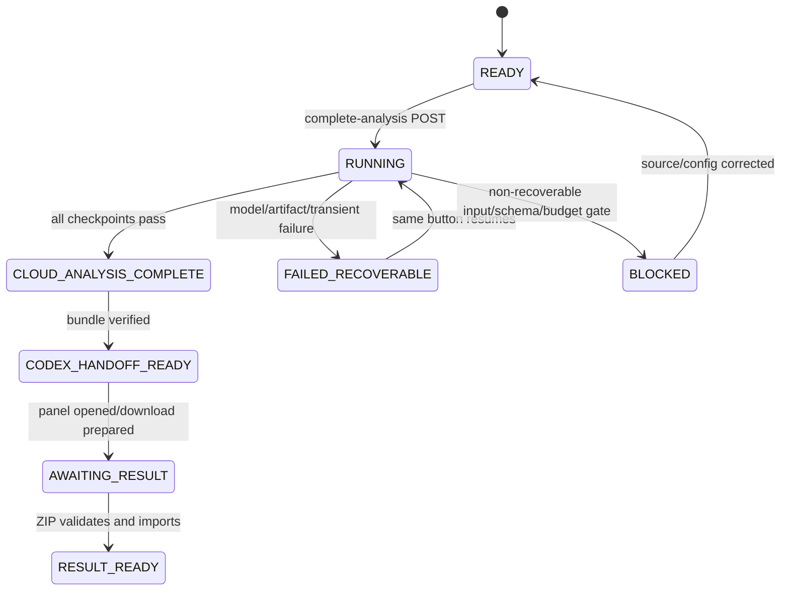
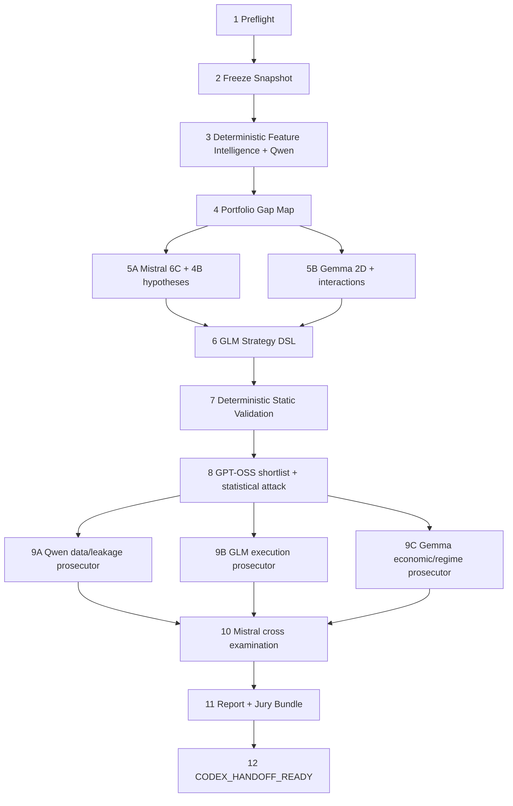

# Multi-LLM Strategy Discovery & Adversarial Audit Lab

Status: design accepted; implementation in progress after clean baseline gate passed
Date: 2026-07-11
Scope: research/audit-only sidecar; no production strategy mutation, retrain, deployment, broker, or real-order ownership

## 1. Repository current state

- Frontend: React 19 + Wouter + Vite 8 under `frontend/`.
- API/orchestration: Hono Worker under `worker/`.
- Existing bindings: D1 `DB`, KV `KV`, R2 `ARTIFACTS`, Workers AI `AI`.
- Missing binding: a dedicated Cloudflare Workflow binding.
- Authentication: route-local `authMiddleware` + `adminMiddleware`; localhost has an explicit local admin identity.
- D1 migrations: flat `worker/migration_*.sql` plus `worker/schema.sql` parity.
- Worker tests: standalone TypeScript tests executed with `npx tsx`; type gates use both Worker tsconfigs.
- Frontend gate: `npm run build`; contract tests use standalone TypeScript scripts.
- Canonical Feature Registry: `data/feature_registry/unified_feature_registry_v1.json`, 902 lineage entries, formal eligible pool 137 = 69 core prior + 68 evidence watch.
- Current production strategy source: remote D1 `strategy_spec_registry`, verified read-only on 2026-07-11 as active=13.
- Worktree is dirty with unrelated production repairs. New code stays in isolated paths and only patches verified route/config/navigation integration points.

## 2. ADR-001 — Extend the existing Worker, isolate the bounded context

Decision: implement the Lab inside the existing Worker and frontend, under a new `strategy-discovery` bounded context and a dedicated admin page.

Reasons:

- Reuses authenticated Hono routes, D1/R2/KV/AI bindings, frontend session handling, package manager, and validation commands.
- Avoids a second source of truth, a second auth surface, and cross-Worker consistency.
- The research-only namespace prevents candidate/discovery code from entering production screener, pending-buy, paper, broker, promotion, retrain, or scheduler owners.

Rejected:

- Rebuilding the attachment's hypothetical root `apps/web` + `src/` tree: incompatible with the repository.
- Adding controls to the existing `/strategy-lab` page: that page already has many operations and cannot satisfy the two-primary-action contract.
- Running the workflow from the browser: loses durable retry/checkpoint guarantees.

## 3. ADR-002 — Read canonical inputs, freeze immutable run snapshots

Decision:

- Feature source is the versioned unified registry. A build-generated compact artifact selects exactly `eligible_for_strategy=true`; it carries the source SHA-256 and fails drift tests if the source changes.
- Strategy source is D1 active `strategy_spec_registry` rows. Preflight requires exactly 13 complete rows and never falls back to the repo's 8 default specs.
- Each run normalizes Feature Cards, Strategy Cards, and Shared System Profile, calculates SHA-256, writes immutable JSON to R2, and records D1 manifests.
- Missing deterministic statistics are serialized as `UNKNOWN`; LLMs cannot fill them.

Implications:

- A future active count other than 13 causes `BLOCKED` with actual/expected counts.
- Candidate and verdict artifacts are research-only and cannot update `strategy_spec_registry` or production tables.

## 4. ADR-003 — D1 is the control plane; R2 is the artifact plane

Decision:

- D1 holds small structured state, checkpoints, lineage, hashes, usage, issues, and verdict summaries.
- R2 holds snapshots, raw/parsed model responses, reports, Jury Bundle, Codex ZIP, and test artifacts.
- No raw model output or ZIP body is stored in D1.
- R2 keys are private and content-addressed below `strategy-discovery/runs/{run_id}/`.

Artifact writes use `put -> read metadata/hash -> D1 manifest`. A D1 manifest without the R2 object is recoverable failure, never a completed result.

## 5. ADR-004 — Cloudflare Workflow with application checkpoints

Decision:

- Export `StrategyDiscoveryWorkflow extends WorkflowEntrypoint` from the existing Worker.
- Configure `[[workflows]]` binding `STRATEGY_DISCOVERY_WORKFLOW`.
- Every logical step has a stable input hash and an application checkpoint in D1/R2.
- A recoverable run creates a new Workflow attempt for the same run ID. Completed checkpoints with unchanged hashes are reused; changed hashes invalidate that checkpoint and all downstream checkpoints.
- Specialist model steps run as independent `step.do()` calls within bounded parallel groups so one failed role does not erase successful role checkpoints.

Cloudflare instance state is execution evidence. D1 `analysis_runs` remains the user-visible state source.

## 6. ADR-005 — Native Workers AI only

Decision:

- Use `env.AI.run`; do not add OpenAI SDK, API key, or OpenAI API calls.
- Qwen/GPT-OSS/GLM/Gemma use native `response_format.json_schema`.
- Mistral uses native `guided_json`.
- Every response receives deterministic local validation.
- One low-cost format repair is allowed; the original long role prompt is not repeated for repair.
- One model-step retry is allowed. A second failure transitions the run to `FAILED_RECOVERABLE`.
- Every call persists model ID, role, model/prompt/schema versions, input hash, token usage, estimated neurons, retry count, validation status, source type (`REAL` or `FIXTURE`), and R2 pointers.

Fixture output is accepted only when `STRATEGY_DISCOVERY_FIXTURE_MODE=1`, is visibly labeled, and never satisfies the real-model acceptance gate.

## 7. ADR-006 — Secure, automatic ZIP interchange

Decision:

- Bundle/result ZIPs are deterministic store-only ZIP archives generated by audited local code; no dependency is required.
- Import parser accepts the package format emitted by the repo skill, rejects unsupported compression, encrypted entries, absolute paths, `..`, duplicate names, oversized bodies, too many entries, and CRC/hash mismatches.
- Import is drag/drop -> POST -> validation -> persistence with no confirmation button.
- Required result files, JSON schemas, run ID, bundle hash, candidate hashes, issue IDs, and evidence rules are validated before verdict writes.
- Private authenticated fetch creates a short-lived browser object URL, revoked after use; R2 is never public.

## 8. Target folder structure

```text
worker/
  migration_strategy_discovery_lab_2026_07_11.sql
  schema.sql
  src/
    index.ts
    routes/strategyDiscoveryRoutes.ts
    strategy-discovery/
      domain.ts
      config.ts
      schemas.ts
      validators.ts
      hashing.ts
      zip.ts
      featureRegistry.ts
      strategyRegistry.ts
      currentState.ts
      repositories.ts
      artifacts.ts
      checkpoints.ts
      aiClient.ts
      deterministicAnalysis.ts
      discovery.ts
      audit.ts
      juryBundle.ts
      codexResult.ts
      conclusion.ts
      workflow.ts
      fixtures.ts
      data/formal137-feature-registry.v1.json
    lib/strategyDiscovery*.test.ts
frontend/src/
  pages/StrategyDiscoveryPage.tsx
  components/strategy-discovery/
    AnalysisButton.tsx
    CodexConclusionButton.tsx
    AnalysisProgress.tsx
    CodexPanel.tsx
    FinalConclusionView.tsx
  lib/strategyDiscoveryApi.ts
  lib/strategyDiscoveryViewModel.ts
  lib/strategyDiscovery*.test.ts
schemas/strategy-discovery/
  feature.schema.json
  strategy.schema.json
  candidate.schema.json
  issue.schema.json
  jury-bundle.schema.json
  codex-result.schema.json
.agents/skills/strategy-discovery-jury/
  SKILL.md
  references/verdict-schema.md
  references/evidence-levels.md
  references/test-catalog.md
  scripts/validate-bundle.ts
  scripts/package-result.ts
  scripts/validate-result.ts
audits/
  inbox/.gitkeep
  outbox/.gitkeep
docs/strategy-discovery-audit-lab/
  ARCHITECTURE.md
  ACCEPTANCE_MATRIX.md
  RUNBOOK.md
```

## 9. D1 schema

All JSON columns contain validated JSON text. Large payloads are R2 pointers.

| Table | Purpose | Core key/index |
|---|---|---|
| `input_snapshots` | Per-run immutable snapshot manifests | PK `snapshot_id`; UNIQUE `(run_id,snapshot_type)` |
| `feature_versions` | Canonical Feature Registry versions | PK `feature_version`; UNIQUE `snapshot_hash` |
| `features` | Versioned Feature Card metadata | PK `(feature_version,feature_id)` |
| `strategy_versions` | Frozen strategy-set versions | PK `strategy_version`; UNIQUE `snapshot_hash` |
| `strategies` | Versioned Strategy Cards | PK `(strategy_version,strategy_id)` |
| `analysis_runs` | Run state/idempotency/provenance | PK `run_id`; UNIQUE `idempotency_key`; indexes `created_at`,`status` |
| `workflow_steps` | Attempt and timing per logical/model step | PK `(run_id,step_id,attempt)`; index `(run_id,step_id)` |
| `workflow_checkpoints` | Reusable input/output hash + R2 pointer | PK `(run_id,step_id)` |
| `model_calls` | Model provenance and usage ledger | PK `call_id`; index `(run_id,role)` |
| `feature_clusters` | Deterministic + Qwen feature map | PK `(run_id,cluster_id)` |
| `gap_maps` | Portfolio gap artifact pointer/summary | PK `run_id` |
| `hypotheses` | 6C/4B/2D hypothesis rows | PK `(run_id,hypothesis_id)` |
| `candidates` | DSL candidates, hashes, state | PK `(run_id,candidate_id)`; index `run_id` |
| `candidate_lineage` | Parent/mutation/mode lineage | PK `(run_id,candidate_id)` |
| `static_validation_results` | Deterministic fail-closed results | PK `(run_id,candidate_id)` |
| `audit_issues` | Normalized/merged issues | PK `(run_id,issue_id)`; index `(run_id,target_id)` |
| `cross_examinations` | Mistral issue status | PK `(run_id,issue_id)` |
| `artifacts` | R2 object manifest and hash | PK `artifact_id`; index `(run_id,artifact_type)` |
| `codex_imports` | ZIP validation/import idempotency | PK `import_id`; UNIQUE `(run_id,result_hash)`; index `run_id` |
| `strategy_verdicts` | Imported strategy verdicts | PK `(run_id,strategy_id)` |
| `candidate_verdicts` | Imported candidate verdicts | PK `(run_id,candidate_id)` |
| `issue_verdicts` | Imported evidence-based issue verdicts | PK `(run_id,issue_id)` |
| `model_accuracy` | Critic confirmed/refuted/duplicate rates | PK `(run_id,model_id,role)` |

No foreign key references production trading tables. Foreign keys exist only inside this bounded context.

## 10. API contract

All routes are authenticated admin-only. All POST routes require `Idempotency-Key`.

```text
GET  /api/dashboard-state
POST /api/full-analysis
GET  /api/runs/:runId/status
GET  /api/runs/:runId/report
GET  /api/runs/:runId/jury-bundle
POST /api/runs/:runId/codex-result
GET  /api/runs/:runId/codex-conclusion
```

- `GET /api/dashboard-state` is the only button-state source.
- `POST /api/full-analysis` creates, rejects, or resumes according to D1 state and preflight.
- `GET /jury-bundle` returns a private ZIP response; frontend converts it to a short-lived object URL.
- `POST /codex-result` accepts `application/zip` with size/entry limits and performs automatic import.

## 11. State machine



UI mapping:

- Analysis: `READY | RUNNING | COMPLETED | FAILED_RECOVERABLE | BLOCKED`.
- Codex: `NOT_READY | HANDOFF_READY | AWAITING_RESULT | RESULT_READY`.

## 12. Workflow diagram



Every node writes a checkpoint with stable input/output hashes. Step 5 models cannot see each other's outputs.

## 13. Model call plan

| Role | Model | Input cap | Output cap | Structured mode | Called |
|---|---|---:|---:|---|---:|
| Feature Librarian | `@cf/qwen/qwen3-30b-a3b-fp8` | 8k | 1.5k | `response_format` | 1 |
| Hypothesis Scientist | `@cf/mistralai/mistral-small-3.1-24b-instruct` | 7k | 2.2k | `guided_json` | 1 |
| Regime Explorer | `@cf/google/gemma-4-26b-a4b-it` | 6k | 1.5k | `response_format` | 1 |
| Execution Architect | `@cf/zai-org/glm-4.7-flash` | 8k | 3.5k | `response_format` | 1 |
| Portfolio Judge + Statistical Prosecutor | `@cf/openai/gpt-oss-120b` | 10k | 2.5k | `response_format` | 1 |
| Data/Leakage Prosecutor | Qwen | 8k | 1.5k | `response_format` | 1 |
| Execution Prosecutor | GLM | 8k | 1.5k | `response_format` | 1 |
| Economic/Regime Prosecutor | Gemma | 8k | 1.5k | `response_format` | 1 |
| Cross Examiner | Mistral | 8k | 2k | `guided_json` | 1 |

Prompts receive compact deterministic cards/summaries, never 1.3M raw rows, secrets, tokens, or untrusted executable instructions.

## 14. Neuron budget plan

Registry rates are stored as neurons per million input/output tokens and versioned with the model config.

| Role group | Expected neurons |
|---|---:|
| Feature intelligence | 83 |
| Hypothesis + regime | 429 |
| DSL generation | 171 |
| GPT shortlist/statistical attack | 489 |
| Three specialist prosecutors | 296 |
| Cross examination | 356 |
| Expected total | 1,824 |
| 25% estimation/availability margin | 456 |
| Preflight reservation | 2,280 |

```ts
dailyHardLimit = 10_000
dailySoftLimit = 8_000
minimumReserve = 2_000
```

Preflight requires `known_used + reserved_other_usage + 2_280 <= 8_000`. Usage source is the Lab D1 ledger plus an operator KV reservation for non-Lab account usage. If usage scope is unknown in strict production mode, analysis is `BLOCKED`; it never silently assumes zero external usage.

## 15. Codex skill design

Skill name: `$strategy-discovery-jury`.

Execution:

1. Locate and validate `audits/inbox/RUN_ID/jury-bundle.zip` or extracted bundle.
2. Verify manifest, required files, schema versions, run/bundle/candidate hashes.
3. Create an isolated worktree or `audits/tmp/RUN_ID/`; never alter production strategies, commit, or merge.
4. Spawn four bounded subagents only for this review: Evidence, Data & Leakage, Test, Methodology.
5. Main jury adjudicates from repository evidence, file lines, commands, test outputs, dataset version, and hashes; never by vote count.
6. Write all required outputs under `audits/outbox/RUN_ID/`.
7. `package-result.ts` validates and creates deterministic `codex-result.zip`.

Evidence rules:

- E0 is not a formal defect.
- E1 remains `UNVERIFIED`.
- E2–E4 can only be produced by Codex repository/test work.
- Confirmed Fatal needs file or test evidence; normally E3.
- `SURVIVED` and `READY_FOR_LOCKED_TEST` explicitly do not prove Alpha.

## 16. Testing strategy

Tests are grouped by pure domain, storage integration fakes, route integration, frontend view models/contracts, ZIP security, Workflow behavior, and local E2E.

Phase gate:

```text
worker type-check
worker targeted unit/integration scripts
frontend targeted unit/contract scripts
frontend build
git diff --check
```

The final matrix maps every section 25 test and section 28 clause to an executable test. A fixture E2E proves local structure. A separate real-model E2E must record at least Qwen, Mistral, GPT-OSS, and GLM or Gemma calls with `source_type=REAL`; fixture evidence cannot close that gate.

## 17. Risks and mitigations

| Risk | Mitigation |
|---|---|
| Active strategy count changes | Exact preflight count + immutable snapshot; concrete blocker |
| Canonical feature registry drifts | Generated snapshot source hash + drift test |
| Workflow beta/runtime drift | D1 checkpoints and recoverable attempts |
| Account-wide AI usage unknown | Strict budget scope gate + operator external reservation |
| JSON schema not honored | Local validator + one repair + fail closed |
| Model unavailable | Cached safe probe; no automatic model substitution |
| Duplicate/overstated LLM issues | Normalizer, deterministic merge, cross examination, Codex evidence rules |
| ZIP bomb/path traversal | byte/entry/ratio/path/CRC/hash/required-file limits |
| Markdown XSS | render sanitized text/structured fields; no raw HTML |
| Candidate leaks into production | no imports/calls to promotion, retrain, trading, or scheduler mutation owners; contract tests |
| Dirty worktree collision | new namespace; narrow integration patches; scoped diff review |

## 18. Implementation milestones

1. Domain/schema/config/migration/hash/ZIP primitives.
2. D1/R2 repositories, canonical input adapters, current-state resolver.
3. Authenticated APIs and dedicated two-button page.
4. Deterministic intelligence, gap/search policy, DSL/static validation.
5. Workers AI client, budget/availability, role prompts, Workflow orchestration.
6. Audit issue pipeline, cross examination, report, Jury Bundle.
7. Codex skill, validators, result packager/importer, conclusion UI.
8. Recovery/security/accuracy/observability hardening.
9. Full automated matrix, fixture E2E, real-model E2E, local-prod-ready/no-partial audit.

No phase proceeds past a failing type/unit/integration gate.
